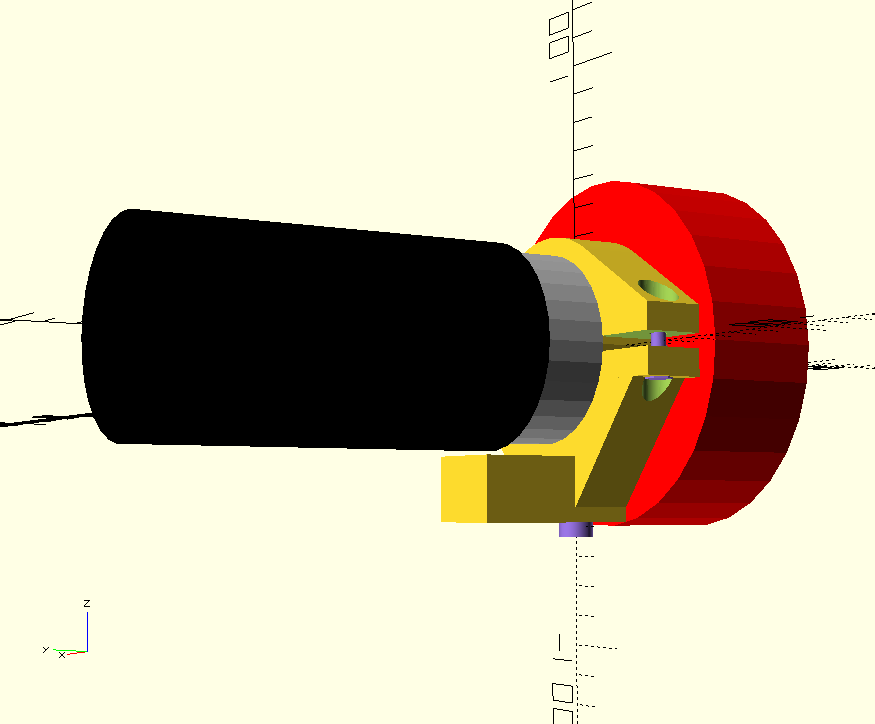

# CameraKlem
OpenSCAD design for Camera Clamp

This is a design for a clamp to mount an Astronomy camera on a telescope mount.

In the following image the yellow part is the clamp, the red part is the camera and the black part is the lens.

The clamp will be mounted in a rail which is connected to the telescope mount.